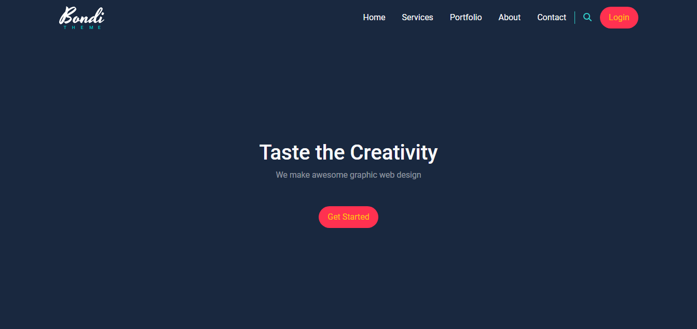

# LaslesVPN

This is a simple landing page built using HTML, CSS, and Bootstrap 5.



## [Live Site](https://ahmed-ali-9-6.github.io/Bondi/)

## Technologies Used


## Installation

To run this project locally, follow these steps:

1. Clone the repository:

   ```bash
   git clone https://github.com/ahmed-ali-9-6/Bondi
   ```

2. Navigate to the project directory:

   ```bash
   cd Bondi
   ```

3. Open the `index.html` file in your preferred web browser.

## Contact

- [Author](https://github.com/ahmed-ali-9-6)
- [Website](https://ahmed-ali-9-6.github.io/My-Portfolio/)
- [Email](mailto:ahmed.ali.hassan108@gmail.com)
- [LinkedIn](https://www.linkedin.com/in/ahmed-ali-993011215/)
